## What is Sentiment Analysis? {.smaller}

`A computational process of identifying and categorizing opinions expressed in a piece of text, to determine whether the writer's attitude towards the topic is positive, negative, or neutral`

::::: columns
::: {.column width="50%"}
-   Analyze digital text to determine emotional tone of text

-   Organizations have large volume of text:

    -   Emails

    -   Customer support chat transcripts

    -   Social media comments

    -   Reviews

-   Tools can scan text automatically to determine writer's attitude
:::

::: {.column width="50%"}
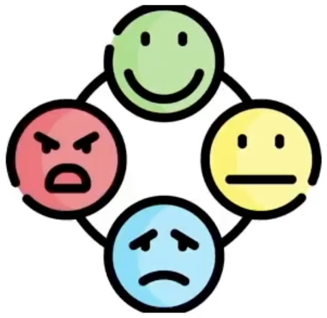{fig-align="center" width="240"}
:::
:::::

::: notes
Let's start this lecture by defining sentiment analysis. Sentiment
analysis is a computational process of identifying and categorizing
opinions expressed in a piece of text to determine whether the writer's
attitude towards the topic is positive, negative, or neutral. These are
the broad categories for sentiment analysis. You could, of course, have
more granular categories if you wanted to, like very positive or mildly
positive, and so on.

So what do you do when you perform a sentiment analysis?

You'll analyze text available in digital form to determine the emotional
tone of the message. Now, organizations have been collecting all kinds
of text for all kinds of reasons for a long time. This text can include
emails, customer support chat transcripts, social media comments, or
even reviews. All of this text contains some information that will be
useful to the organization. Sentiment analysis tools can automatically
scan text to determine the writer's attitude and tone, and this can give
organizations important insights into their customers.
:::

## Importance of Sentiment Analysis

-   Objective insights
-   Enhanced product and service development
-   Scalability in data analysis
-   Real-time market response

::: notes
So how can sentiment analysis tools help businesses? They offer
businesses objective and consistent results in evaluating customer
opinions, reducing personal bias that might occur with human reviewers.
This allows organizations understand diverse customer perspectives and
learn how customers respond to their products. These tools can also help
organizations enhance their products and services. By identifying
specific entities and sentiments associated with them, sentiment
analysis enables companies to pinpoint areas for improvement in their
products and services. These tools enable scalability in data analysis.
There is a vast amount of structured data generated from various
sources, emails, surveys, customer feedback.

Sentiment analysis tools allow businesses to efficiently process and
analyze this data at scale, helping them stay informed about customer
opinions and trends. And real-time sentiment analysis empowers
businesses to quickly respond to emerging trends or potential crises.
Businesses can receive instant alerts on negative sentiments and take
proactive measures to address customer concerns.
:::

## Sentiment Analysis Use Cases

-   Improve customer service
-   Brand monitoring
-   Market research
-   Track campaign performance
-   Refine public relation strategies
-   Product or service monitoring
-   Support political analysis

::: notes
So where could businesses use sentiment analysis in improving their
customer service?

This allows customer support teams to personalize their responses by
understanding the mood of the conversation. By analyzing sentiments
expressed in social media forums, blogs, and news articles,
organizations can monitor their brand's public perception.

Sentiment analysis can help understand customer preferences and dislikes
based on their feedback on various platforms, and this assists in market
research for new products and services. Marketers can use sentiment
analysis to gauge the public reaction to their advertising campaigns.
These tools can also be used for planning and implementing effective PR
strategies, understanding customer grievances, identifying trends, and
leveraging social media influencers.

Sentiment analysis can be used to gauge customer reactions to new
products or services using feedback from e-commerce sites and other
platforms. Sentiment analysis is very useful in the political arena as
well. Public platforms like Twitter, now X, help authorities gauge
public reaction to new policies, and political parties can use this data
to refine their strategies.
:::

## Approaches to Sentiment Analysis {.smaller}

::::: columns
::: {.column width="50%"}
-   Rule-based
:::

::: {.column width="50%"}
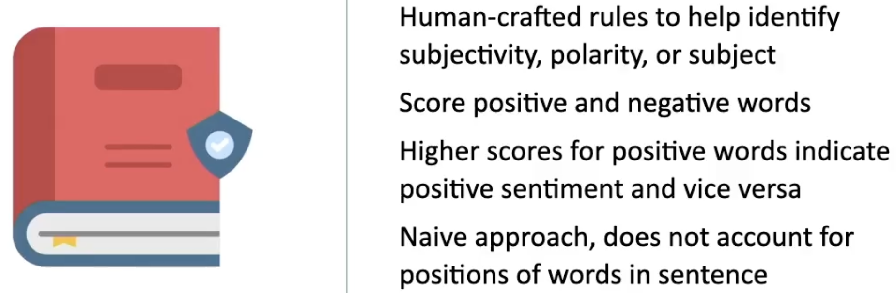{width="494"}
:::
:::::

::::: columns
::: {.column width="50%"}
-   Machine Learning

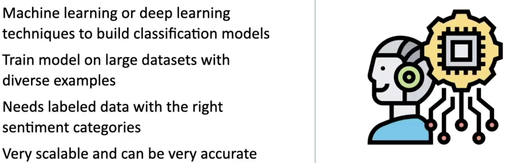{width="506"}
:::

::: {.column width="50%"}
-   [ ] Training Machine Learning Model 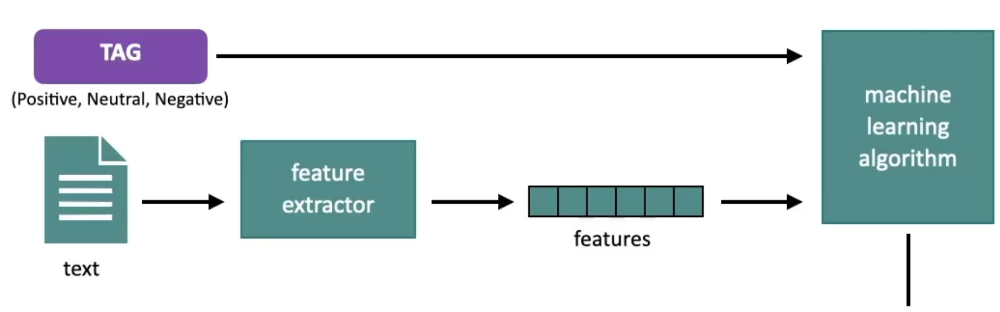

-   [ ] Using Model for Predictions 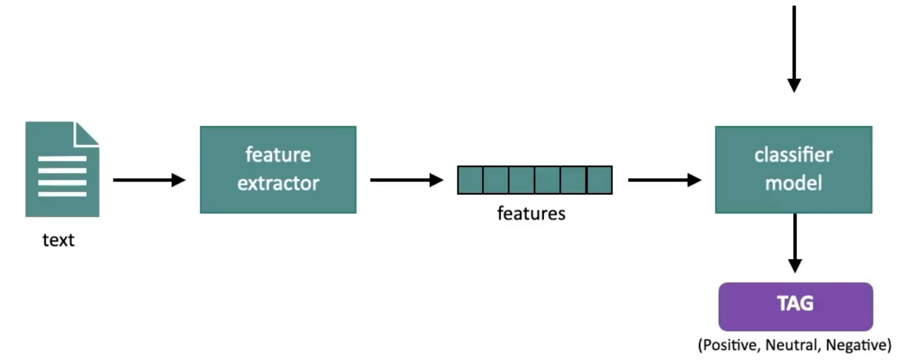
:::
:::::

::: notes
Let's, discuss in a little more detail some of the common approaches to
sentiment analysis which include: Rule-based sentiment analysis, Machine
learning-based sentiment analysis, and hybrid sentiment analysis.

Let's start by understanding how rule-based sentiment analysis works.
This is where you'll set up human-crafted rules to help identify
subjectivity, polarity, or subject matter of the text. You'll use some
kind of system. Let's say words like happy, affordable, fast will be in
the positive lexicon, and words like poor, expensive, and difficult will
be in the negative lexicon. You'll then set up word scores for positive
and negative words. Let's say scores from 5 to 10 denote positive words,
scores from -1 to -10 denote negative words. Thus, every document will
generate a score, with higher scores for positive words and lower scores
for negative words. So overall, if the document has a high score, you
know it has positive sentiment.

A rule-based sentiment analysis system is straightforward to set up, but
it's hard to scale. It's also a naive approach because it does not
account for the positions of words in a sentence or a document. When you
discover new keywords for conveying intent in the text input, you'll
need to keep expanding your lexicons. This approach may also not be
accurate when processing sentences influenced by different cultures.

Next, let's go to machine learning-based approaches to sentiment
analysis. Sentiment analysis is, at its heart, a classification problem.
You are trying to categorize text as positive, negative, or neutral
sentiment, so you can use machine learning or deep learning techniques
to build these classification models that are trained on large datasets,
with diverse examples belonging to the different sentiment categories.
This allows the software to differentiate and determine how different
word arrangements affect the final sentiment score. Of course, the one
prerequisite is, you need labeled data with the right sentiment
categories.

Classification is a supervised learning technique, which means there is
a lot of pre-processing involved in actually getting the labeled data,
and that can be hard to set up. But once you have the labeled data,
machine learning techniques are very scalable and can be very accurate
in their prediction. This is a high-level overview of the training phase
of a classification model. You have the input text with the right tags
or labels, positive, neutral, negative. You tokenize, lemmatize, and
extract features from the input text. You convert the input text to
vector encodings or word embeddings. These are the features that you use
to train the machine learning algorithm. Once you have a trained machine
learning model, you can use it for prediction. Your prediction text will
go through the same pre-processing techniques that you use for your
training data. So you'll tokenize it, lemmatize it, extract features,
convert the words to vector representations or word embeddings, and then
you'll feed that into the model to get a prediction from the model.
:::

## Approaches to Sentiment Analysis {.smaller}

-   Hybrid

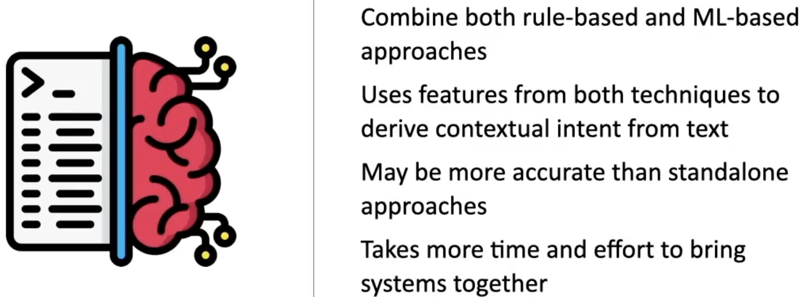{fig-align="center" width="517" height="201"}

::: notes
Since both rule-based approaches and ML-based approaches have their own
advantages, the hybrid approach seeks to combine both of them. It
combines both of the approaches to get the best of both worlds. It uses
features from both methods to optimize the speed and accuracy when
deriving the contextual intent in text.

In practice, you may find that the hybrid approach, overall, gives you
more accurate analysis than standalone approaches. However, it takes
more time and effort to bring rule-based and machine learning-based
systems together in a coherent way, so it may be harder to implement.
:::

## Word Vector Embeddings {.smaller}

`Machine learning only works on numeric input. How do we represent text in numeric form?`

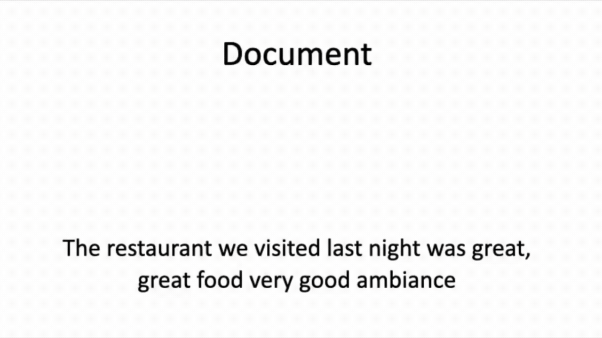{fig-align="center" width="690"}

::: notes
`{Refresh this page to see the gif video}`

When you think about machine learning models, you know that ML models
only process numeric data, and this is true of neural networks as well.

So the big question when you're working with neural networks for
sentiment analysis is how do we represent text in numeric form? Another
way to put it, how do we express words as numbers so that ML models can
understand them?

Let's consider a document or text that we want to feed into a machine
learning model for sentiment analysis. Here is a review of a restaurant.
"The restaurant we visited last night was great, great food very good
ambience." Now the first thing you do is reprocess the document.. So all
of the stop words are removed and the document is entirely in a lower
case. You might get rid of all of the punctuation as well. You then
tokenize this document where you'd extract tokens, which could be entire
words or portions of words.

So let's for simplicity, assume that every word in this document becomes
a separate token after tokenization. Once you have these individual
tokens from the document, the next step is for you to figure out how to
represent these tokens numerically. You now need to represent each token
in some numeric form.

So every bit of text or every document that you feed into your machine
learning model is represented using a tensor of tokens where a tensor is
just a multidimensional array.
:::

## Types of Sentiment Analysis {.smaller}

::::: columns
::: {.column width="50%"}
-   Graded
:::

::: {.column width="50%"}
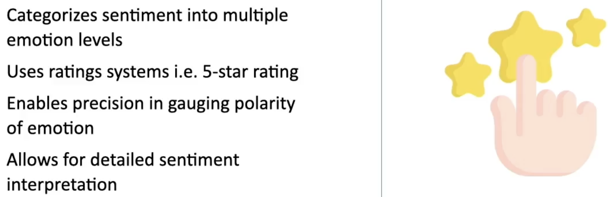
:::
:::::

-   Aspect-based

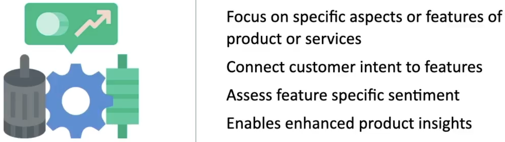{fig-align="center" width="491"}

::::: columns
::: {.column width="50%"}
-   Intent-based
:::

::: {.column width="50%"}
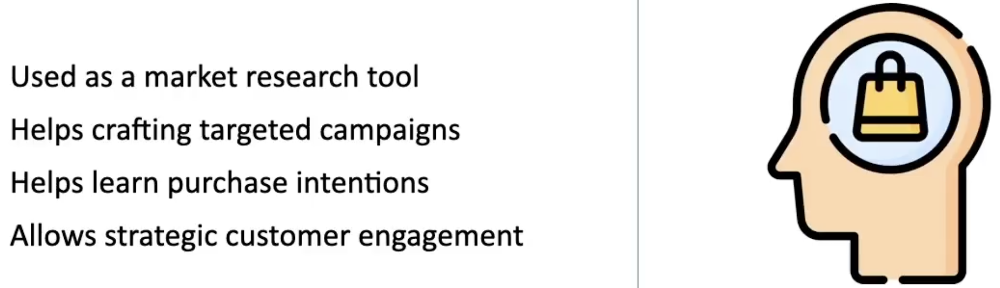{width="560"}
:::
:::::

::: notes
There are different types of sentiment analysis that you can perform on
data and we'll discuss a few of those types. There is graded sentiment
analysis, aspect-based sentiment analysis, intent-based sentiment
analysis, and emotional detection.

Let's start with the first of these categories, graded sentiment
analysis, and understand how this works. Graded sentiment analysis
categorizes sentiment into multiple emotion levels. For example, you
might think of sentiment as positive, neutral, negative, very negative
or very positive, and you might grade these on a scale one to hundred.
Graded sentiment analysis is commonly used in e-commerce systems via a
five-star rating system to assess customer experience with products or
services. This allows you to granularly express what you think of the
product or service. This kind of sentiment analysis enables precision,
engaging the polarity of the emotion. It's ideal for businesses
requiring detailed sentiment categorization, translating star ratings
into corresponding sentiment levels. Having grades of emotion helps in
understanding nuanced customer feedback by distinguishing between
different degrees of positive and negative sentiment.

Next, we have aspect-based sentiment analysis. Now, if you are offering
a product, there are different aspects or features of the product that
customers might comment on. This kind of analysis concentrates on
particular features or aspects of a product or service, like a laptop's
sound or keyboard quality. It tries to link customer sentiments to
specific product attributes, identifying how each aspect is perceived.
For example, if you buy a new laptop, you might like the look and feel
of the laptop, but you might feel that the battery is not powerful
enough. This is aspect-based sentiment analysis; figuring out what
exactly you like and what you don't for the same product. This kind of
analysis assesses sentiments about individual features, distinguishing
overall product sentiment from specific aspect sentiment. This provides
detailed feedback for targeted improvements in different aspects of a
product or service.

Next, we have intent-based sentiment analysis. This kind of sentiment
analysis is widely used as a market research tool. This is utilized in
understanding customer positions in the purchase cycle; very valuable
for market research. This kind of sentiment analysis helps in crafting
targeted marketing campaigns by picking up on specific customer
interests, like discounts or deals on specific products. The idea to do
intent-based sentiment analysis is to analyze sentiments to understand
the likelihood of customer purchases, and it enables businesses to
engage with customers based on their purchase readiness and interests.
:::

## Types of Sentiment Analysis {.smaller}

-   Emotional detection

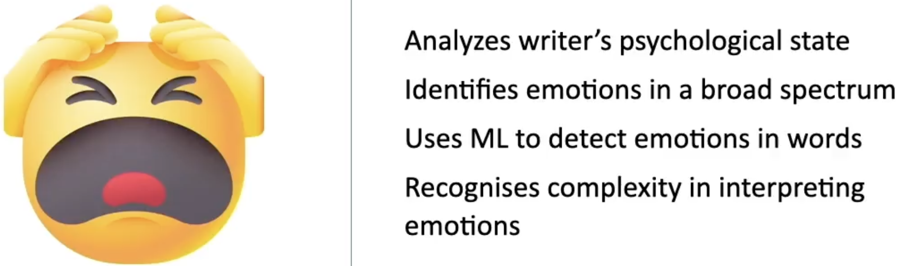{fig-align="center" width="606" height="180"}

::: notes
And finally, the fourth and last kind of sentiment analysis we'll
discuss today is emotional detection. This involves psychological state
analysis. It goes beyond basic sentiment categories to analyze the
writer's psychological state. It tries to identify emotions on a broad
emotional spectrum, identifies a range of emotions such as joy, anger,
sadness, and frustration from the input text. It employs wordless or
machine learning algorithms to discern the emotions conveyed by specific
words. This analysis recognizes the diverse ways emotions can be
expressed, accounting for context and varied expressions of feelings.
:::

## Challenges in Sentiment Analysis

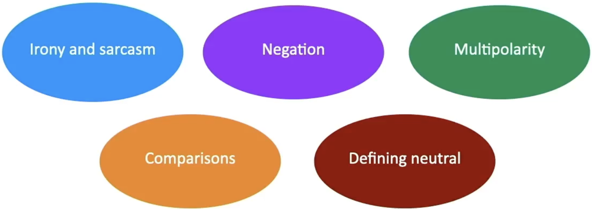

::: notes
Let's discuss some challenges that you'd encounter in sentiment
analysis. 

It's extremely difficult for machines to analyze sentiment in
sentences that have `sarcasm`. Let's say you say something like, "Yes,
great, it took three weeks for my order to arrive." Unless the sentiment
analysis system has a deeper understanding of the context, it's likely
to label this as a positive sentence when it really isn't. 

Sentiment
analysis systems also find it hard to deal with `negation` in sentences.
This is the use of negative words to convey a reversal of meaning in the
sentence. Let's say you say something like, "I wouldn't say this was a
bad meal." Sentiment analysis algorithms might have difficulty
interpreting such sentences correctly. 

Systems also find it hard to deal
with `multipolarity`. This occurs when a sentence contains more than one
sentiment. If a product review is something like, "I'm happy with the
color of the product, but not happy with how long it took to deliver."
In order to extract the true sentiment of this sentence, you'll need to
use aspect-based sentiment analysis. 

Sentiment analysis systems also
find it hard to deal with `comparisons`. If you have text such as, "This
product is second to none," or, "This is better than nothing," this is
hard for systems to interpret. 

Another challenge with sentiment analysis
is defining what is meant by `neutral`. 
In all classification problems,
defining your categories, and in this case, the neutral tag is one of
the most important parts of the problem. What you mean by neutral,
positive, or negative does matter when you train sentiment analysis
problems. Objective texts might be considered neutral. Irrelevant
information might be neutral. Text that contain wishes like, "I wish
this was offered in a different color," that might be neutral, but, "I
wish this worked better, might not be neutral.
:::
