## Introduction {.smaller}

`Definition`

***Topic***

-   It is "a recurring pattern of co-occurring words" [(Brett, 2012)](https://journalofdigitalhumanities.org/2-1/topic-modeling-a-basic-introduction-by-megan-r-brett/)
-   A topic can be defined as the main idea discussed in a text, i.e., the theme or subject of different granularity
-   Topics are simply groups of words from the collection of documents that represents the information in the collection in the best way

***Topic Modeling***

-   It is "a method for finding and tracing clusters of words (called *topics*) in large bodies of texts" [(Brett, 2012)](https://journalofdigitalhumanities.org/2-1/topic-modeling-a-basic-introduction-by-megan-r-brett/)
-   It is a text mining approach to understand, organize, process, extract, manage, and summarize knowledge

:::notes
From this module onwards, we are going to learn the different approaches to perform text mining. First one is topic modeling.  

Let’s start with the idea of a topic. According to Paul Brett, a topic can be understood as a recurring pattern of co-occurring words. In other words, when certain words frequently appear together across a collection of documents, they tend to signal an underlying theme or subject.

More generally, a topic represents the main idea discussed in a text. This can exist at different levels of granularity. For example, a broad topic might be something like “health,” while a more specific topic could be “mental health during pandemics.” So, topics are flexible, they can be coarse or fine-grained depending on the context and the analysis.

From a computational perspective, topics are often represented as groups of words that tend to appear together in a collection of documents. These groups are not labeled in advance but are inferred from the data, and they serve as a way to summarize and represent the information contained in large text collections.

On contrast, topic modeling is defined as a method for discovering clusters of words, or topics, within large bodies of text. Instead of manually reading and categorizing documents, topic modeling allows us to automatically identify patterns and themes across thousands—or even millions—of documents.

More broadly, topic modeling is a text mining approach that helps us understand, organize, and process large volumes of textual data. It enables us to extract meaningful structure, manage information more efficiently, and ultimately summarize knowledge in a way that would be difficult to achieve through manual analysis alone.

Topic modeling does not “understand” text in a human sense, it identifies statistical patterns of word co-occurrence that we interpret as meaningful themes.
:::

## Introduction {.smaller}

-   It performs *soft clustering*, where it presumes that every document is composed of a mixture of topics
-   It makes an excellent tool for discovery and helps to uncover evidence already present in the text
-   It has been called an act of reading tea leaves (Chang et al., 2009) or the process of highlighting words (Brett, 2012) based on their topics
-   It is based on statistical and machine learning techniques to mine meaningful information from a vast corpus of unstructured data and is used to mine document's content
-   A subject expert (human-in-loop) is needed to label the topics

:::notes
One of the key characteristics of topic modeling is that it performs what is known as `soft clustering`. Unlike hard clustering, where each document is assigned to a single category, topic modeling assumes that every document is a mixture of multiple topics. For example, a single article might simultaneously relate to politics, economics, and public health, each to a different degree.

Because of this, topic modeling is a powerful tool for exploration and discovery. It helps us uncover patterns and themes that are already present in the text but may not be immediately visible, especially when dealing with large collections of documents.

At the same time, it’s important to approach topic modeling with the right expectations. Researchers like Jonathan Chang have described it as an act of “reading tea leaves,” emphasizing that interpretation is not always straightforward. Similarly, Paul Brett describes it as a process of highlighting words based on their association with topics. These metaphors remind us that topic modeling provides signals and patterns, not definitive meanings.

Under the hood, topic modeling relies on statistical and machine learning techniques to analyze large amounts of unstructured text data. It identifies patterns of word co-occurrence and uses those patterns to infer latent topics, which can then be used to explore and summarize document collections.

However, an important limitation is that topic models do not automatically assign meaningful labels to topics. This is where the human-in-the-loop becomes essential. A subject expert is needed to interpret and label the topics, making sense of the word clusters and connecting them to meaningful themes.
:::

## Some Important Concepts (Recap) {.smaller}

::::::::::::::: panel-tabset
## Bags of Words

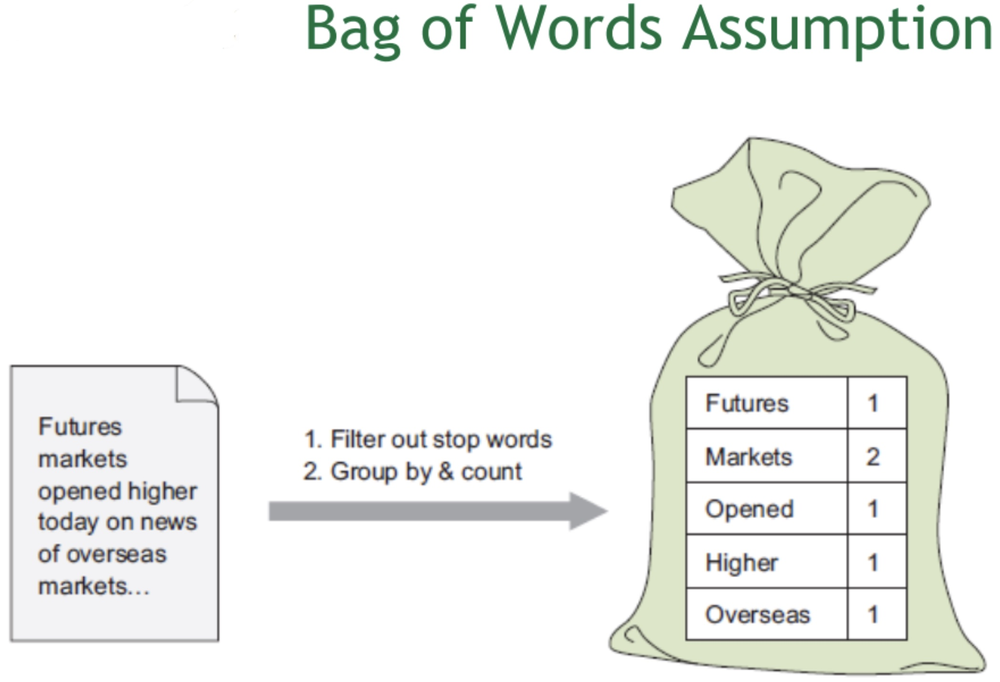{fig-align="center" width="65%"}

::: notes
Let's recap some of the important text-preprocessing concepts that we will be using before performing topic modeling. 

First is the Bag of Words model. It is one of the simplest and most widely used methods for representing text in a numerical form.

The key idea behind Bag of Words is to represent a document based on the frequency of words it contains, without considering grammar, sentence structure, or word order. In other words, the document is treated like a “bag” of individual words, where only the presence and count of words matter.

As shown in the example on the slide, we start with a sentence: “Futures markets opened higher today on news of overseas markets.” The first step is to preprocess the text, which typically includes removing stopwords such as “today,” “on,” and “of,” because they do not carry significant meaning for analysis.

After removing stopwords, we then group the remaining words and count how many times each word appears. This produces a frequency table. For example, the word “markets” appears twice, while words like “futures,” “opened,” “higher,” and “overseas” appear once.

This process converts the text into a structured, numerical format, which is necessary because machine learning algorithms cannot directly work with raw text. They require numerical input.

One important characteristic of the Bag of Words model is that it ignores word order and context. For example, the sentences “markets opened higher” and “higher opened markets” would produce the same Bag of Words representation. This makes the model simple and efficient, but it also means that it does not capture deeper meaning or relationships between words.

---

Second is the Term-Document Matrix or TDM. It is an important way to represent text in a structured, numerical format. A Term-Document Matrix is essentially a table that shows how frequently each term appears in each document within a corpus. This allows us to convert text into numbers, which is necessary for machine learning and text analysis.

As shown in the example on the slide, we begin with a small corpus consisting of three documents. Each document contains some text, such as “text analysis is fun,” or “I like doing text analysis.”

After preprocessing steps like tokenization and stopword removal, we identify the unique terms across all documents. These terms become the rows of the matrix, and the documents become the columns of the matrix.

Each cell in the matrix contains a number that represents the frequency of a specific term in a specific document. For example, if the word “text” appears once in document 1 and once in document 2, but not in document 3, the matrix will show values of 1, 1, and 0 in the corresponding row.

This matrix representation is extremely useful because it transforms unstructured text into a structured numerical form that can be used by machine learning algorithms.

The Term-Document Matrix is closely related to the Bag of Words model, since it is essentially the structured implementation of word frequency counts across multiple documents.
---

Third is the Document-Term Matrix or DTM. It is another important way to represent text in numerical form for analysis.

A Document-Term Matrix is very similar to the Term-Document Matrix. The main difference is the orientation of the rows and columns. In a Document-Term Matrix, each document is represented as a row, and each term, or word, is represented as a column.

As shown in the example on the slide, we begin with a small corpus of three documents. After preprocessing steps such as tokenization and removing stopwords, we identify the unique terms across all documents. These unique terms form the columns of the matrix.

Each row represents one document, and each cell contains the frequency of a specific term in that document. For example, if the word “text” appears once in document 1 and once in document 2, but not in document 3, the matrix will show values of 1, 1, and 0 in the corresponding column.

The Document-Term Matrix is essentially the transpose of the Term-Document Matrix, meaning the rows and columns are swapped. Both representations contain the same information, but the Document-Term Matrix is often more convenient for machine learning applications because many algorithms expect data in the form of rows as observations and columns as features.
---
Finally we have Term Frequency–Inverse Document Frequency, commonly known as TF-IDF. It is one of the most important and widely used techniques in text preprocessing and information retrieval.

TF-IDF is a method used to measure how important or relevant a word is to a specific document within a corpus. Unlike simple word counts, TF-IDF does not treat all words equally. Instead, it assigns different weights to words based on their importance.

TF-IDF consists of two main components: Term Frequency, or TF, and Inverse Document Frequency, or IDF.

Term Frequency measures how often a word appears in a particular document. The idea is that words that appear more frequently in a document are likely to be more important for describing that document.

However, some words may appear frequently across many documents, such as common terms like “data,” “system,” or “information.” These words may not be very useful for distinguishing one document from another. This is where Inverse Document Frequency comes in.

Inverse Document Frequency reduces the weight of words that appear frequently across many documents and increases the weight of words that are rare across the corpus. This helps highlight words that are more unique and informative.

By combining these two measures, TF-IDF assigns higher weights to words that appear frequently in a specific document but not frequently across all documents. These words are called discriminative terms, because they help distinguish one document from another.

TF-IDF is extremely useful in many applications, including search engines, document ranking, text classification, and recommendation systems. For example, search engines use TF-IDF to determine which documents are most relevant to a user’s query.

Compared to simple Bag-of-Words counts, TF-IDF provides a more meaningful representation because it emphasizes important words and reduces the influence of common words.

TF-IDF is a powerful weighting technique that helps identify the most relevant and informative words in a document, improving the performance of text mining techniques.
:::

## TDM

::::: columns
::: {.column width="65%"}
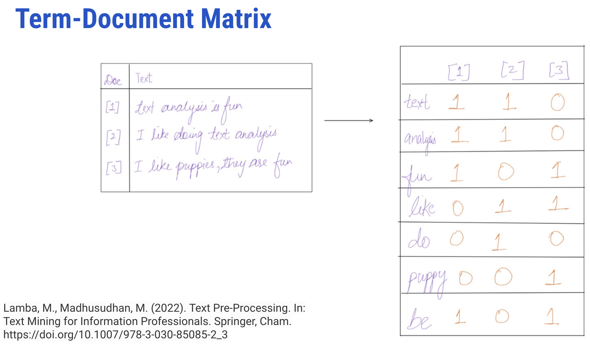{fig-align="center"}
:::

::: {.column width="35%"}
-   It represents terms as a table or matrix of numbers for a given corpus
-   In TDM, terms are represented as rows and documents as columns for a corpus where the number of occurrences of terms in the document is entered in the boxes
:::
:::::


## DTM

::::: columns
::: {.column width="65%"}
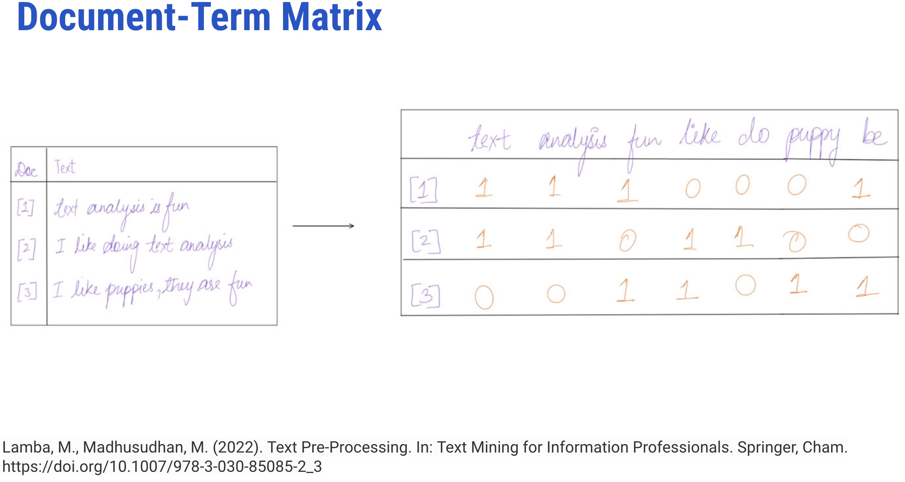{fig-align="center"}
:::

::: {.column width="35%"}
-   It represents terms as a table or matrix of numbers for a given corpus
-   It is a transposition of TDM
-   In DTM, each document is a row, and each word is the column
:::
:::::


## TF-IDF

::::: columns
::: {.column width="65%"}
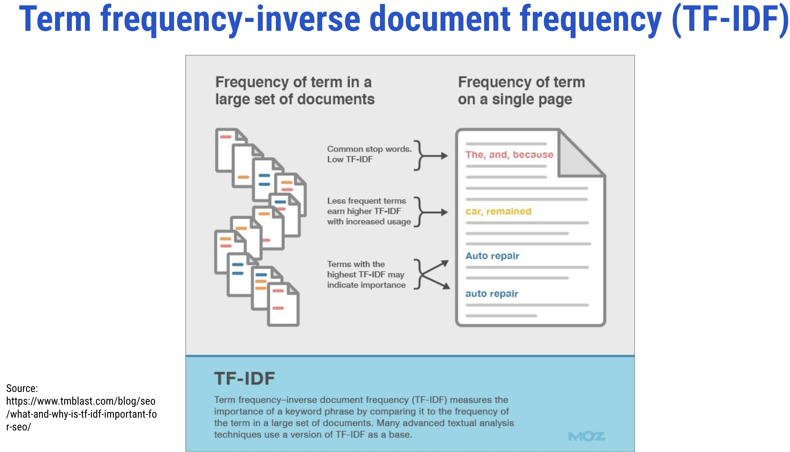{fig-align="center"}

It evaluates the relevancy of a term for a document in a corpus and is the most popular weighting scheme in information retrieval (IR)
:::

::: {.column width="35%"}
-   The term **weighting** is popularly used in IR and supervised machine learning tasks like text classification
-   It makes a list of more discriminative terms than others and assigns a weight to each highly occurring term
:::
:::::
:::::::::::::::


## What Happens in Topic Modeling? {.smaller}

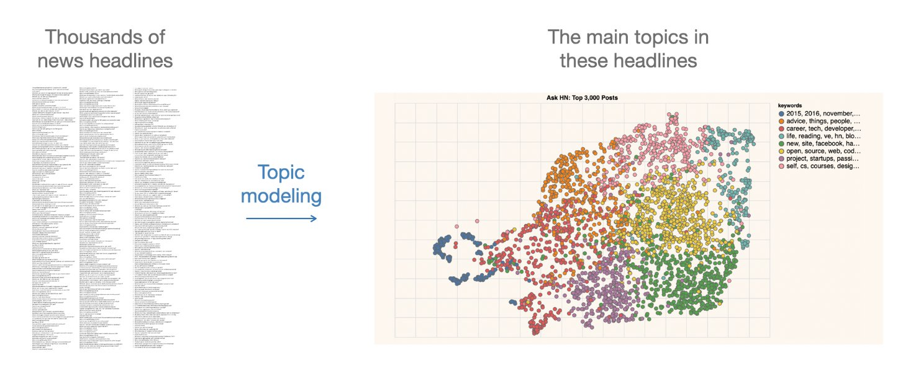{fig-align="center" width="65%"}

-   It infers abstract topics based on "similar patterns of word usage in each document"
-   These topics are simply groups of words from the collection of documents that represents the information in the collection in the best way

::: notes
Let's visualize what actually happens during topic modeling using an example.

On the left, you can see an examples of news headlines as a dataset which is unstructured and difficult to interpret at scale. If you were to read through all of these manually, it would take a significant amount of time, and identifying overall themes would not be straightforward.

But after we apply topic modeling, the model analyze the patterns of word usage across all these documents and looks for words that frequently appear together and identifies recurring combinations across the dataset.

On the right, you can see the result of the topic modeling that organizes the documents into **clusters based on these shared patterns**, where each color represents a different topic. These clusters are not labeled automatically—they are simply groupings of documents that share similar word usage patterns.

This illustrates that topic modeling **infers abstract topics** by detecting similarities in how words are used across documents. It does not rely on predefined categories, but instead discovers structure directly from the data.

The topics themselves are essentially **groups of words** that tend to co-occur. These word groups serve as a compact representation of the underlying themes in the collection. In other words, they summarize the information in the dataset in a way that is computationally efficient and analytically useful.

So, what you’re seeing here is the transformation from **raw, unstructured text** to a more **organized, interpretable structure**, where patterns that were previously hidden become visible.

Thus, topic modeling helps us move from *reading documents one by one* to *understanding large collections at a thematic level*, even though the interpretation of those themes still requires human judgment.
:::

## How Topic Modeling Works?{.smaller}

::::: columns
::: {.column width="50%"}
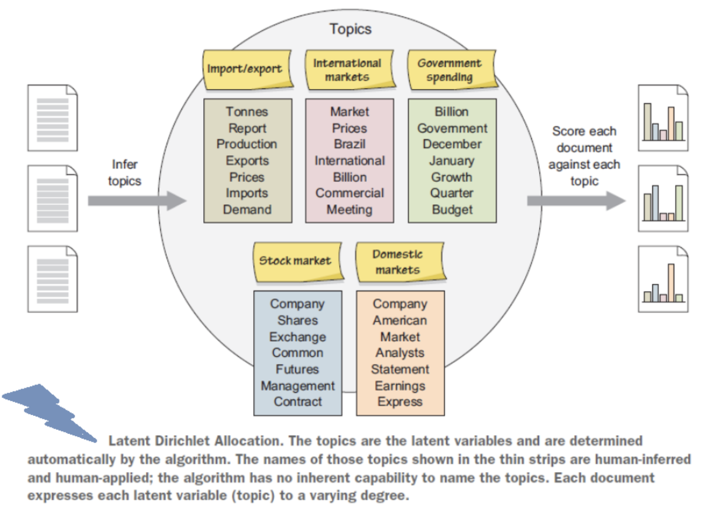{fig-align="center"}
:::

::: {.column width="50%"}
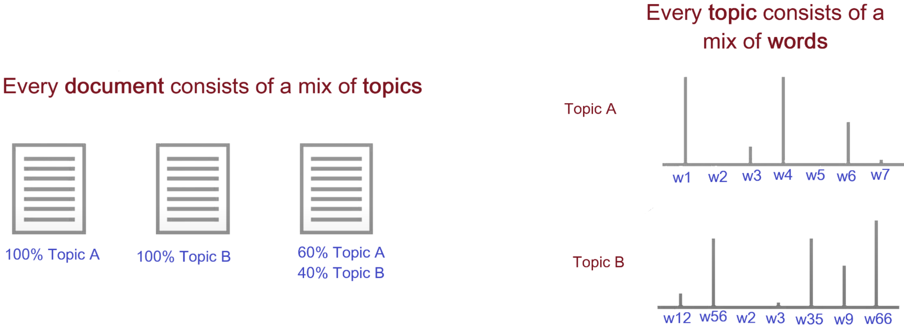{fig-align="center"}
:::
:::::

::: notes
Now, let's take a closer look at how topic modeling actually works.

As you can see from the diagram on the left, we begin with a collection of documents. The model processes these documents and infers latent topics. Each topic is represented as a distribution of words—for example, one topic might include words related to import and export, another to international markets, and another to government spending.

It’s important to understand that these topics are not predefined. They are discovered automatically by the algorithm based on patterns of word co-occurrence. The labels we see—like “international markets” or “stock market”—are actually assigned by humans after the fact to help interpret the results. The model itself only produces groups of words with associated probabilities.

Once the topics are identified, the model then scores each document against each topic, as shown on the right. This means that every document is represented as a mixture of topics, rather than belonging to just one category.

This idea is further illustrated on the diagram on the right side. Some documents may be almost entirely about a single topic. For example, 100% Topic A or 100% Topic B. But more commonly, documents are combinations of topics, such as 60% Topic A and 40% Topic B. This is what we mean by soft clustering.

From the diagram, we see that each topic is itself a mixture of words. The bars represent the probability or importance of each word within the topic. Some words are more strongly associated with the topic, while others have lower weights.

So, topic modeling works by learning two things simultaneously. First, it identifies topics as distributions of words. Second, it represents each document as a distribution over those topics.
:::

## Topic Analysis + Time  {.smaller}

-   It assists in identifying topics within a context and how they advance in time
-   For instance, over time, few documents within a topic may initiate content that varies from the original content; if that initiated content is shared by a lot of later documents, the content is recognized as a new topic
-   Hence, with the progression of time, topics advance, new themes emerge, and old ones become obsolete
-   So, topic modeling not just helps the librarians to decide the trending topics or related fields to their field of intrigue but additionally encourages them to distinguish new concepts and fields over time

::: notes
So far, we’ve discussed how topic modeling helps us identify themes within a collection of documents at a given point. But one of its most important applications is in analyzing how topics evolve over time.

Topic modeling allows us to track how the prominence and composition of topics change across different time periods. This means we can not only identify what topics exist, but also observe how they emerge, grow, shift, or decline.

For example, within an existing topic, a small number of documents may begin to introduce new patterns of word usage --- new terms, concepts, or perspectives that differ from the original theme. Initially, this variation may be minor or limited to a few documents.

However, if these new patterns begin to appear more frequently in later documents, they can eventually form a distinct and coherent cluster. At that point, what started as a variation within a topic may be recognized as a new topic altogether.

This process reflects how language and knowledge evolve. Over time, new themes emerge, existing topics transform, and some topics gradually become less relevant or even obsolete.

From an applied perspective, this is particularly valuable in fields like library and information science, research analytics, and digital humanities. Topic modeling can help professionals identify trending topics, monitor shifts in discourse, and discover emerging areas of interest or research.

Thus, topic modeling is not just a tool for static analysis, it is also helps in understanding temporal dynamics in large text collections.
:::

## How to DO Topic Modeling?  {.smaller}


1.  Extract/Retrieve dataset (e.g. webscraping, API, etc.)
2.  Preparing a corpus (such as converting files from PDF to plain text format)
3.  Conducting text pre-processing (removing stopwords, tokenization, stemming, n-grams)
4.  Exploratory analysis (Word clouds, clustering)\
5.  Determining the number of topics (using perplexity, coherence, entropy, or eye-ball method)
6.  Selecting the appropriate algorithm (such as LDA, STM, CTM)
7.  Seeding (so that one can reproduce the algorithm with the same selected parameters)
8.  Running the selected algorithm using proprietary or open-source tools (such as RapidMiner, TopicModelingTool) or programming languages (such as R or Python)
9.  Iterating the whole process till the algorithm fits the model


::: notes
Let's walk through the workflow for performing topic modeling, from raw data to final results. It’s important to understand that topic modeling is not a single step, it’s an **iterative process** that involves multiple stages.

We begin with **data collection**. This involves extracting or retrieving a dataset, which could come from sources such as web scraping, APIs, databases, or digital archives. The quality and relevance of your data at this stage will strongly influence everything that follows.

Next, we move to **corpus preparation**. This often involves converting files into a consistent, machine-readable format—for example, converting PDFs into plain text. The goal here is to ensure that the data is clean, accessible, and ready for analysis.

Once we have the corpus, we perform **text preprocessing**. This includes tasks such as removing stopwords, tokenization, stemming or lemmatization, and sometimes generating n-grams. These steps help standardize the text and reduce noise, making it easier for the model to detect meaningful patterns.

Before jumping into modeling, it’s useful to conduct **exploratory analysis**. Techniques like word clouds or basic clustering can give you an initial sense of the data and help identify dominant terms or patterns.

One of the most important decisions is **determining the number of topics**. This can be guided by quantitative measures such as perplexity, coherence, or entropy, but often also involves interpretability, what is sometimes referred to as the “eye-ball method.”

Next, we select an appropriate **topic modeling algorithm**, such as Latent Dirichlet Allocation (LDA), Structural Topic Modeling (STM), or Correlated Topic Models (CTM). The choice depends on the research question, data characteristics, and desired outputs.

We also often use **seeding**, which ensures that the model can be reproduced with the same parameters. This is especially important for transparency and consistency in research.

After that, we **run the model** using either specialized tools or programming environments like R or Python. At this stage, the algorithm generates topics and assigns topic distributions to documents.

Finally and this is critical we **iterate**. Topic modeling is not a one-shot process. We refine pre-processing steps, adjust parameters, reconsider the number of topics, and rerun the model until the results are both **statistically sound and meaningfully interpretable**.
:::

## When to Use Topic Modeling  {.smaller}


-   When you have a vast collection of text documents
-   When the collection belongs to a specific subject
-   When the collection has a similar type of documents, such as when all files in the collection are newspaper articles

:::notes
Topic modeling works best when you have a large collection of text documents. The strength of these models lies in identifying patterns across many documents, so having sufficient data is important.

It is also particularly effective when the collection belongs to a specific subject area or domain. For example, analyzing a large set of research articles in a single discipline or a corpus of news articles on a particular topic can yield meaningful and coherent themes.

Finally, it also performs well when the documents are relatively homogeneous in type. For instance, if all documents are newspaper articles, research papers, or social media posts. This consistency helps the model detect patterns more reliably.
:::

## When NOT to Use Topic Modeling  {.smaller}


-   When you have a relatively small number of documents
-   When you do not have any idea about your collection. In this case, clustering will be a better option than using topic modeling
-   When the collection has a mixture of different types of documents, such as when the collection is composed of newspaper archives, journal articles, and ETDs

:::notes
If you have a small number of documents, topic modeling is unlikely to produce meaningful or stable topics, because there simply isn’t enough data for patterns to emerge.

It is also not ideal when you have no understanding of your collection at all. In such cases, simpler techniques like clustering or exploratory analysis may be more appropriate as a starting point before applying topic modeling.

Another limitation arises when the dataset contains a mixture of very different document types. For example, combining newspapers, journal articles, and theses in a single corpus. This kind of heterogeneity can confuse the model and lead to less interpretable topics.
:::

## Available Tools and Packages  {.smaller}

:::::: columns
::: {.column width="40%"}
**Out-of-Box Tools**

-   [Topic Modeling Tool](https://code.google.com/archive/p/topic-modeling-tool/)
-   [RapidMiner](https://rapidminer.com/)
-   [VyontTools](https://voyant-tools.org/)
-   [DARIAH Topics Explorer](https://dariah-de.github.io/TopicsExplorer/)
-   [ORANGE](https://orangedatamining.com/)
-   [jsLDA](https://mimno.infosci.cornell.edu/jsLDA/jslda.html) ..... (more!)
:::

::: {.column width="30%"}
**R Libraries**

-   [quanteda](https://quanteda.io/)
-   [stm](https://cran.r-project.org/web/packages/stm/vignettes/stmVignette.pdf)
-   [tm](https://cran.r-project.org/web/packages/tm/tm.pdf)
-   [lda](https://cran.r-project.org/web/packages/lda/lda.pdf)
-   [topicmodels](https://cran.r-project.org/package=topicmodels)
-   [text2vec](https://cran.r-project.org/web/packages/text2vec/index.html)
-   [topicdoc](https://cran.r-project.org/web/packages/topicdoc/index.html)
-   [BTM](https://cran.r-project.org/web/packages/BTM/index.html)
-   [tidytext](https://cran.r-project.org/web/packages/tidytext/vignettes/tidytext.html)
-   [textmineR](https://cran.r-project.org/package=textmineR) .....(more!)
:::

::: {.column width="30%"}
**Python Libraries**

-   [bertopic](https://pypi.org/project/bertopic/)
-   [corextopic](https://pypi.org/project/corextopic/)
-   [scikit-learn](https://pypi.org/project/scikit-learn/)
-   [corextopic](https://pypi.org/project/corextopic/)
-   [genism](https://pypi.org/project/gensim/)
-   [lda](https://pypi.org/project/lda/)
-   [tethne](https://pythonhosted.org/tethne/)
-   [dynamic_topic_modeling](https://pypi.org/project/dynamic-topic-modeling/) .....(more!)
:::
::::::

::: notes
This slide lists a range of available tools and packages for topic modeling.

There are several out-of-the-box tools, such as Topic Modeling Tool, RapidMiner, Orange, and DARIAH Topics Explorer, which are useful for users who prefer graphical interfaces and minimal coding.

For those working in R, there are multiple libraries like quanteda, stm, topicmodels, tidytext, and text2vec, which provide flexibility and strong integration with data analysis workflows.

Similarly, in Python, popular libraries include bertopic, scikit-learn, gensim, and others, offering a range of approaches from traditional probabilistic models to more recent embedding-based methods.
:::

## Algorithms  {.smaller}

-   [Latent Dirchlet Allocation, 2003](https://www.jmlr.org/papers/volume3/blei03a/blei03a.pdf)

-   [Hierarchal Latent Dirichlet Allocation (hLDA), 2003](https://proceedings.neurips.cc/paper/2003/file/7b41bfa5085806dfa24b8c9de0ce567f-Paper.pdf)

-   [Correlated Topic Model (CTM), 2005](https://proceedings.neurips.cc/paper_files/paper/2005/file/9e82757e9a1c12cb710ad680db11f6f1-Paper.pdf)

-   [Dynamic Topic Model (DTM), 2006](https://mimno.infosci.cornell.edu/info6150/readings/dynamic_topic_models.pdf)

-   [Correlation Explanation (CorEx), 2016](https://arxiv.org/abs/1611.10277)

-   [Structural Topic Model (STM), 2019](https://cran.r-project.org/web/packages/stm/vignettes/stmVignette.pdf)

-   [GuidedLDA, 2018](https://github.com/vi3k6i5/guidedlda)

-   [LDA2Vec, 2019](https://aclanthology.org/N19-1414.pdf)

-   [BERTopic, 2022](https://arxiv.org/abs/2203.05794) . . . more!

::: notes

Topic modeling has evolved from probabilistic models like LDA to more advanced approaches that incorporate hierarchies, correlations, time, metadata, and deep learning. The choice of algorithm depends on your data, research question, and the level of interpretability you need. Let's look at some of the major algorithms used in topic modeling, along with a rough timeline of how the field has evolved.

We begin with Latent Dirichlet Allocation, or LDA, introduced in 2003. This is the foundational and most widely used topic modeling algorithm. LDA assumes that documents are mixtures of topics and that topics are distributions over words. Many of the later models build on or extend this basic framework.

Also introduced around the same time is Hierarchical LDA, or hLDA, which extends LDA by organizing topics into a hierarchical structure. Instead of flat topics, this model allows us to see relationships between broader and more specific themes.

Next, the Correlated Topic Model, or CTM, developed in 2005, addresses a limitation of LDA by allowing topics to be correlated with each other. In real-world data, topics are rarely independent, and CTM captures those relationships.

The Dynamic Topic Model, or DTM, introduced in 2006, incorporates time into topic modeling. It allows us to study how topics evolve over time, which is especially useful for longitudinal datasets like news archives or research publications.

Moving forward, Correlation Explanation, or CorEx, introduced in 2016, takes a different approach. It focuses on maximizing information and interpretability, and it allows for guided or semi-supervised topic modeling, where domain knowledge can be incorporated.

The Structural Topic Model, or STM, builds on LDA by incorporating metadata, such as document source, author, or time, directly into the model. This makes it particularly useful for social science and policy research.

Guided LDA is another variation that allows users to seed topics with predefined words, helping guide the model toward more meaningful or domain-relevant topics.

More recent approaches, such as LDA2Vec, combine traditional topic modeling with word embeddings, aiming to capture both global topic structure and local semantic relationships between words.

Finally, models like BERTopic, introduced more recently, leverage transformer-based embeddings and clustering techniques. These approaches often produce more coherent topics, especially in modern NLP applications.

:::

## Topic Visualization  {.smaller}

-   `Open questions`:

**1.  How we use the output of the algorithm?**

**2.  How should we visualize and navigate the topical structure?**

**3.  What do the topics and document representations tell us about the texts?**

-   Output of topic modeling is not entirely human-readable, and one way to understand the results is through visualization
-   "Topic models are meant to help interpret and understand texts, but it is still the researcher's job to do the actual interpreting and understanding" (Blei, 2012)
-   "Be sure that you can understand the visualization as topic modeling tools are fallible" (Blei, 2012)

::: notes
Now, let's shift our focus to topic visualization, which is a crucial step in making sense of topic modeling results.

After running a topic model, we are left with outputs such as word distributions for topics and topic distributions for documents. While these are mathematically meaningful, they are not immediately human-readable. This is why visualization plays such an important role as it helps us translate abstract model outputs into something we can interpret and analyze.

This leads us to a few important open questions.

First, `how do we actually use the output of the algorithm?`

Running a model is only the beginning. The real task is to interpret what the topics represent and how they relate to our research questions.

Second, `how should we visualize and navigate the topical structure?`

There are many ways to do this, such as topic-term bar charts, intertopic distance maps, or document-topic distributions, but each visualization highlights different aspects of the model. Choosing the right visualization depends on what you are trying to explore or communicate.

Third, `what do these topics and document representations actually tell us about the texts?`

Topics are not ground truth, they are statistical patterns. It is up to us to determine whether these patterns are meaningful, coherent, and relevant to our analysis.

As David Blei reminds us, topic models are designed to help us interpret and understand texts, but the responsibility for interpretation still lies with the researcher. The model provides structure, but it does not provide meaning on its own.

He also cautions that we should be careful with visualizations. Just because something is visually appealing or seems clear does not mean it is accurate. Topic modeling tools are not perfect, and visualizations can sometimes be misleading if not critically evaluated.
:::

## Case Studies {.smaller}

::::::::::: panel-tabset
## iArxiv

::::: columns
::: {.column width="50%"}
[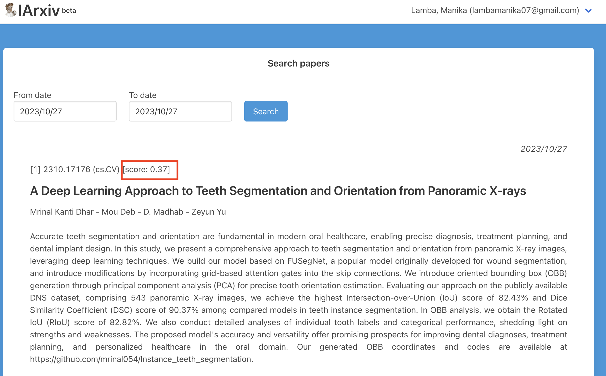{fig-align="center" width="200%"}](https://iarxiv.org/)
:::

::: {.column width="50%"}
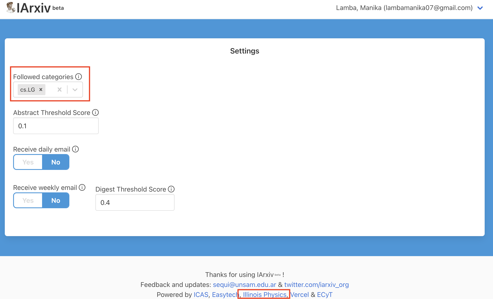{fig-align="center" width="200%"}
:::
:::::

::: footer
:::

## CORD-19

[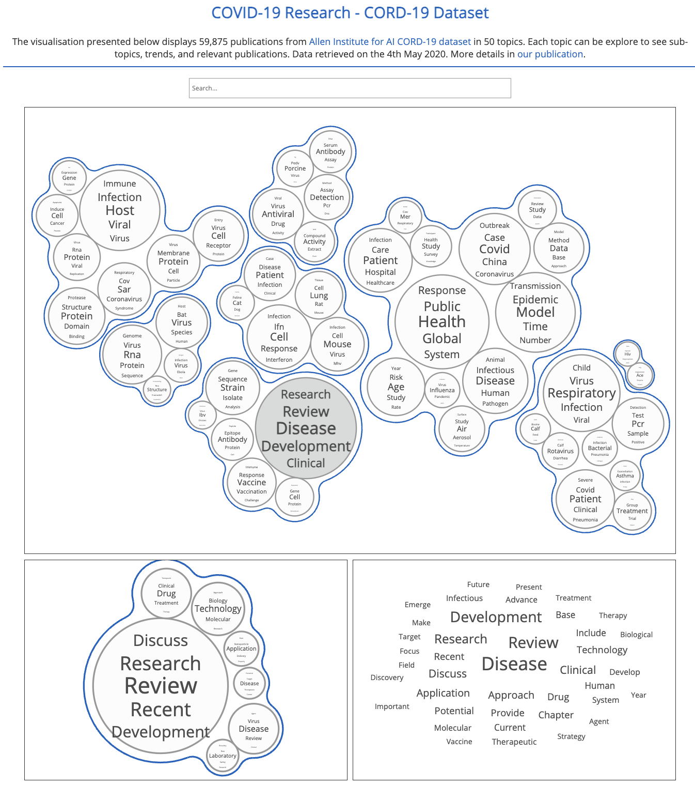{fig-align="center" width="40%"}](https://strategicfutures.org/TopicMaps/COVID-19/cord19.html)

::: footer
:::

## COVID-19

[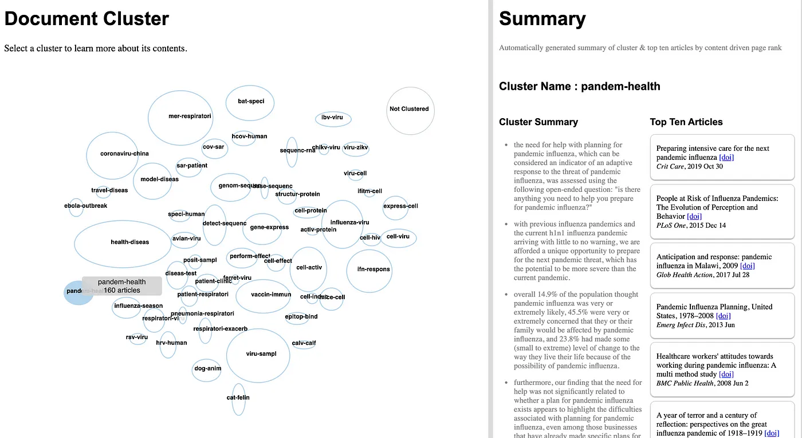{fig-align="center" width="80%"}](https://engineering.tableau.com/visually-exploring-the-covid-19-research-literature-6ff2f70035cb)

::: footer
:::

## Topic Hex-Maps

[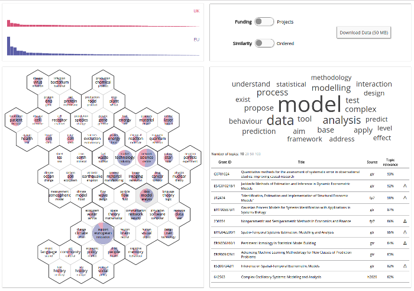{fig-align="center" width="70%"}](https://strategicfutures.org/hexmaps/ukeutopics/2017-01/app/)

::: footer
:::

## COVID-19 Research

[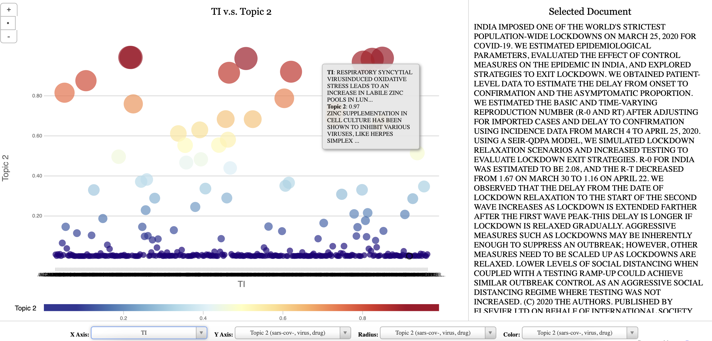{fig-align="center" width="70%"}](https://manika-lamba.github.io/stm/)

## ETD Dashboard

[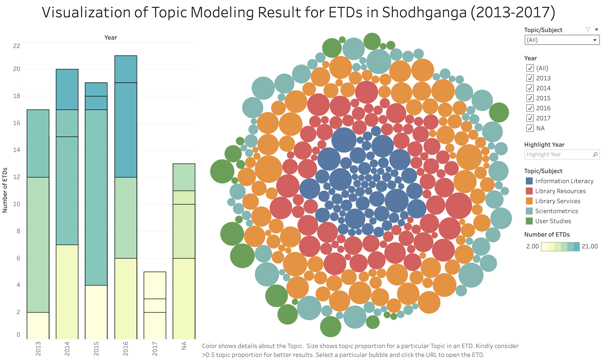{fig-align="center" width="55%"}](https://manika-lamba.github.io/project/etds/)
:::::::::::

::: notes
I have compiled several examples of topic visualizations from projects that used topic modeling. **Click on the images to explore each project in a new window**.

*(Click on each tab to view the content)*
:::


## Topic models do not model topics {.smaller}

-   It operates from  

    -   relevantly unrealistic assumptions and non-deterministic

    -   cannot effectively be validated against a reasonable number of competing models

    -   does not lock into a well-defined linguistic interface

    -   does not scholarly model topics in the sense of themes or content (*not true anymore - BERTopic + LLM*)

-   Features are intrinsic make interpretation of its results prone to

    -   **apophenia**: human tendency to perceive random state sets of elements as meaningful patterns
    -   **confirmation bias**: human tendency to perceptually prefer patterns that are in alignment with pre-existing biases

-   While partial validation of the statistical model is possible, a **conceptual validation** would require an extended triangulation with other methods and human ratings, and clarification of whether statistical distinctivity of lexical co-occurrence correlates with conceputal topics in any reliable way

::: footer
Source: <https://hal.science/hal-03261599v3>
:::

:::notes
Like any other method, topic modeling is not perfect. It should be used critically, with an awareness of its assumptions and limitations, and always in combination with human interpretation.

Let's take a critical perspective on topic modeling:

1. Topic models do not capture topics in the way humans understand them as coherent themes, ideas, or narratives. Instead, they model statistical patterns of word co-occurrence, which we then interpret as topics.

2. Topic models rely on simplifying and sometimes unrealistic assumptions about how language works. For example, many models assume that words are generated independently given a topic, which does not fully reflect the complexity of natural language.

3. Topic modeling is often non-deterministic. This means that running the same model multiple times can produce slightly different results, depending on initialization and parameter settings. This variability can make interpretation and reproducibility more challenging.

4. There is also the issue of validation. Unlike many supervised machine learning tasks, there is no clear “ground truth” for topics. As a result, it is difficult to rigorously evaluate whether one model is objectively better than another, especially across a reasonable number of competing models.

5. Topic models do not map neatly onto a well-defined linguistic framework. They operate at a statistical level, rather than aligning directly with established linguistic categories such as syntax, semantics, or discourse structures.

6. Traditional topic models do not truly capture themes or content in a scholarly sense. The “topics” they produce are abstractions that require human interpretation and may not always align with meaningful conceptual categories.

That said, it’s important to note that this critique is evolving. More recent approaches, such as embedding-based models like BERTopic and integrations with large language models, are beginning to produce more coherent and interpretable topics, narrowing the gap between statistical patterns and human-understandable themes.

7. Because topic models produce statistical groupings of words, the interpretation of these groupings is highly dependent on the researcher. This makes the process vulnerable to certain cognitive biases.
    - One such bias is apophenia, which is the human tendency to perceive meaningful patterns in random or unrelated data. When we look at a list of words generated by a topic model, we may be inclined to impose a coherent theme—even when the underlying pattern is weak or ambiguous.
    - Another related issue is confirmation bias. This is the tendency to favor interpretations that align with our pre-existing expectations or hypotheses. For example, if we expect to find certain themes in our dataset, we may unconsciously interpret topics in ways that confirm those expectations, rather than critically evaluating alternative interpretations.

These challenges highlight the difficulty of validating topic models. While we can partially validate the statistical performance of a model—using measures like coherence or perplexity—this does not guarantee that the topics correspond to meaningful conceptual categories.

True validation at a conceptual level would require triangulation. This means combining topic modeling results with other methods—such as qualitative analysis, manual coding, or human evaluations—to assess whether the identified patterns genuinely reflect meaningful topics.

It also raises a deeper question: does statistical distinctiveness in word co-occurrence reliably correspond to conceptual topics as understood by humans? The answer is not always clear, and this remains an open area of research.


:::


## Application of Topic Modeling in Libraries {.smaller}

::::::::::::: panel-tabset
## Data

::::: columns
::: {.column width="50%"}
-   Topic modeling has been applied to numerous resources, such as

    -   annual meetings
    -   diary
    -   clinical notes
    -   case reports
    -   newspapers
    -   journals
    -   research articles
    -   preprints
:::

::: {.column width="50%"}
```         
- patents
- conferences
- chats
- online reviews
- MOOCs
- call for papers
- social media platforms
- RSS feed
- blogs
- open-ended survey responses
- emails
- digital libraries’ resources
- smart card data
- EZproxy daily log files
- data from library mobile apps
- virtual libraries’ resources
- reference questions
- library databases
- in-house journals
- institutional and digital repository resources
- theses and dissertations
- WebOPACs
- MOOC feedback, chats, and suggestions
- online library chats 
- forums
- emails
- syllabuses
- library’s social media platform accounts
```
:::
:::::

::: footer
:::

## Use Cases

**1. Making Ontologies**: Mehler and Walitinger used topic modeling to build a Dewey Decimal Classification (DDC)-based topic classification model in digital libraries

**2. Automatic Subject Classification**: They can be used in libraries to index subject terms for documents

**3. Bibliometrics**: It can be used to study evolutionary pathways, citations, and trends to explore different hot and cold topics of research in a particular discipline

**4. Altmetrics**: It can be used to know what people are talking about your library on social media and what topics they care about

::: footer
:::

## Use Cases (Cont.)

**5. Recommendation Service**: It can be used to recommend electronic resources based on the reading or search habits of the users

::::: columns
::: {.column width="30%"}
{fig-align="center"}
:::

::: {.column width="70%"}
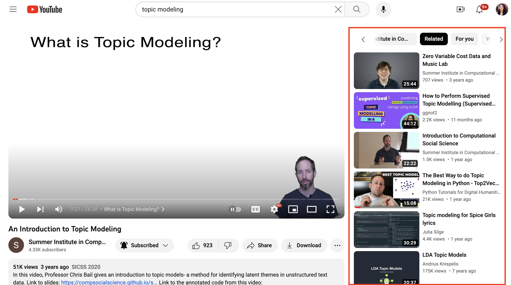{fig-align="center"}
:::
:::::

::: footer
:::

## Use Cases (Cont.)

**6. Organization and Management of Resources**: It can be used to do metadata tagging of the electronic resources, library's database, website, and repository resources

**7. Better Searching and Information Retrieval of Resources**: In digital libraries, it can help in providing a fast searching experience to users and better information retrieval of electronic resources

:::notes
This slide highlights how topic modeling is applied in library contexts, showcasing various data-driven use cases such as organizing collections, discovering research trends, and enhancing information retrieval. It also emphasizes how these applications support decision-making and improve access to knowledge across different library services.

*(Click on each tab to view the content)*
:::
